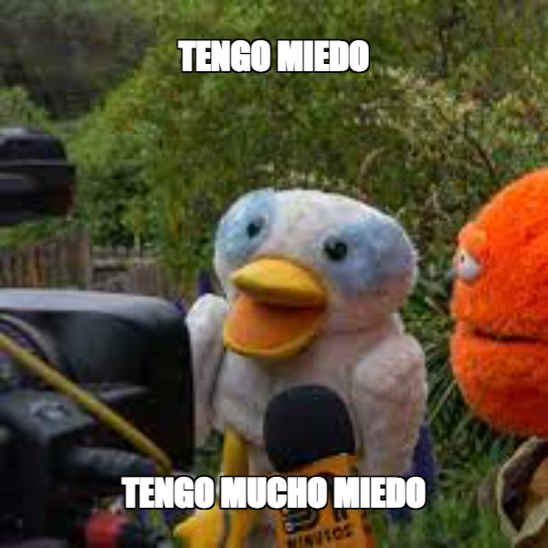

## GENERADOR DE MEMES

### Es una página la cual se puede crear un meme a partir de la manipulación de una imagen y dos textos.

#### Funcionalidades
- ##### Alternar paneles.
- ##### Descargar imagen.
- ##### Modo claro, modo oscuro.

##### La imagen puede tener diferentes filtros y fondo.
##### El texto puede tener diferentes tamaños, colores, fondo, bordes, margenes, alineacion.

 

##### El proyecto es responsivo, puede visualizarse tambien en tablets y celulares.

 
 

##### Lenguajes utilizados y aprendidos:
- ##### HTML
- ##### CSS
- ##### JAVASCRIPT

#### Para ir a la página [click aqui](https://eveolmedo.github.io/Generador-de-memes/)